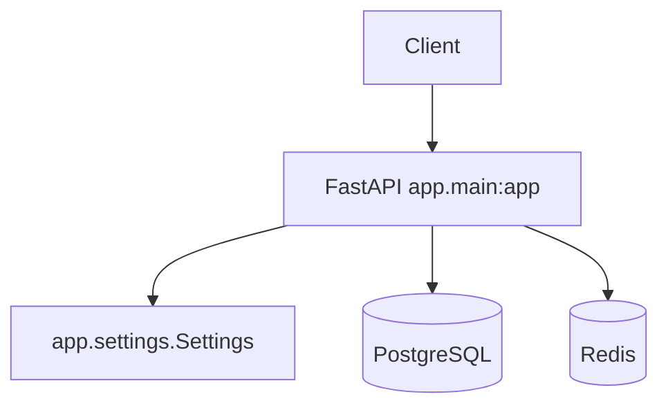

# scene-story-agent 프로젝트

## 문서 메타
이 문서는 프로젝트 구조와 변경 영향 범위의 기준이다.

- 생성일: 2026-05-21
- 목적: Python 프로젝트의 구조와 변경 영향 범위를 설명한다.
- 문서 성격: 구조/아키텍처 개요 문서
- 책임 범위(정본): 프로젝트 구조, 런타임, 패키지 경계, 데이터 접근, 외부 연동의 최종 기준
- 포함 범위: 런타임 형태, 엔트리포인트, 코드 구조, 모듈 맵, 데이터/API 접근, 외부 연동, 테스트 진입점
- 제외 범위: 실행 명령, 환경 생성 절차, 세부 코딩 규칙
- 연계 문서: `.project/core_code_style.md`, `.project/core_workflow.md`
- 중복 방지 기준:
  - 실행 명령과 환경 관리 절차는 `.project/core_workflow.md`에만 기록한다.
  - 타입 힌트, 모델/스키마, 테스트 작성 규칙은 `.project/core_code_style.md`에만 기록한다.
  - 본 문서에는 구조와 영향 범위만 기록한다.
- 근거 소스: `README.md`, `AGENTS.md`, `requirements.txt`, `app/main.py`, `app/settings.py`, `docker-compose.yml`, `docs/*.md`

## 프로젝트 개요
`scene-story-agent`는 원본 기록과 AI 해석 정보를 함께 다루는 FastAPI 서비스다.

### 목적
사용자가 남긴 사진, 영상, 메모를 원본 기록으로 보관하고, AI 해석과 벡터 검색으로 기록 사이의 연결을 보여준다.

### 주요 기능
- 현재 구현:
  - API 기본 응답
  - 프로세스 헬스체크
  - PostgreSQL, Redis readiness 확인
- 문서상 목표:
  - 사진, 영상, 메모 원본 기록 저장
  - 사진 기반 AI 해석 정보 생성
  - 임베딩 벡터 생성과 유사 기록 검색
  - 재방문 후보와 타임라인 후보 생성

### 핵심 도메인
- 원본 기록
- AI 해석 정보
- 임베딩 벡터
- 연관 기록 후보
- 작업 상태

### 런타임 개요
- 실행 형태: FastAPI API 서버
- 엔트리포인트: `app/main.py`의 `app`
- 패키지 구조: `app` 단일 패키지
- 배포 대상: 확인 필요

## 프로젝트 유형
이 저장소는 Python/FastAPI 프로젝트로 판정한다.

- 판정 근거:
  - `requirements.txt`에 `fastapi[standard]`가 있다.
  - `app/main.py`에 `app = FastAPI(...)`가 있다.
  - `app/settings.py`가 Pydantic Settings로 환경 변수를 읽는다.
- 제외한 후보:
  - Java: `pom.xml`, `build.gradle`, `src/main/java` 근거가 없다.
  - Node.js/TypeScript: `package.json`, `tsconfig.json`, `src/**/*.ts` 근거가 없다.
- 사용 reference:
  - `/Users/home/.codex/skills/ct-init/references/ct-init-python.md`

## 아키텍처 개요
현재 구현은 API 엔트리포인트와 의존 서비스 확인으로 구성된다.



## 기술 스택
현재 파일로 확인되는 기술만 확정한다.

### Runtime
- Python: 버전 확인 필요
- FastAPI 서버: `fastapi[standard]==0.136.1`

### Framework
- FastAPI
- Pydantic Settings

### Data Access
- PostgreSQL 연결 확인: `psycopg[binary]==3.2.13`
- Redis 연결 확인: `redis==7.1.0`
- ORM: 확인 필요
- DB 마이그레이션: 확인 필요

### Test/Quality
- 테스트 프레임워크: 확인 필요
- lint: 확인 필요
- typecheck: 확인 필요
- format: 확인 필요

### Packaging
- 패키지 관리자: `pip`
- 의존성 파일: `requirements.txt`
- build backend: 확인 필요

## 코드베이스 구조
현재 실제 구조는 로컬 런타임, 인프라, 문서 기준 파일로 구성된다.

```text
.
├── AGENTS.md                  # 라우팅 전용 문서
├── README.md                  # 프로젝트 진입 문서
├── requirements.txt           # Python 런타임 의존성
├── docker-compose.yml         # 로컬 PostgreSQL, Redis 구성
├── .env.local                 # 로컬 환경 변수 파일
├── .env.dev                   # 개발 서버 환경 변수 키
├── .env.prd                   # 운영 서버 환경 변수 키
├── infra/                     # 로컬 인프라 이미지와 초기화 SQL
│   └── postgres/              # PostgreSQL 18.4 + pgvector 로컬 이미지
├── .project/                  # 프로젝트 기준 문서
│   ├── core_project.md        # 구조와 아키텍처 기준
│   ├── core_code_style.md     # 구현 스타일 기준
│   └── core_workflow.md       # 실행과 운영 절차 기준
├── app/                       # FastAPI 런타임 코드
│   ├── __init__.py            # Python 패키지 선언
│   ├── main.py                # API 앱과 헬스체크 라우트
│   └── settings.py            # 환경 변수 설정 객체
├── scripts/                   # 로컬 개발 실행 스크립트
│   ├── local.sh               # macOS/Linux local 실행
│   ├── dev.sh                 # macOS/Linux dev 실행
│   ├── prd.sh                 # macOS/Linux prd 실행
│   ├── local.ps1              # Windows PowerShell local 실행
│   ├── dev.ps1                # Windows PowerShell dev 실행
│   └── prd.ps1                # Windows PowerShell prd 실행
└── docs/                      # 제품, 기술, 인프라, 개인정보 문서
    ├── product-spec.md        # 제품 정의와 MVP 범위
    ├── technical-spec.md      # 기술 선택과 처리 흐름
    ├── database-design.md     # PostgreSQL 테이블과 삭제 연계 설계
    ├── development-infra.md   # 인프라 구성과 운영 기준
    ├── privacy-compliance.md  # 개인정보 처리 기준
    └── fastapi-quickstart.md  # FastAPI 로컬 시작 절차
```

- 구조 판단:
  - 현재 런타임 코드는 `app` 바로 아래 파일 3개로만 구성된다.
  - 로컬 인프라는 `infra/postgres`와 `docker-compose.yml`에서 관리한다.
  - 반복 실행 명령은 `scripts`에서 관리한다.
  - `tests`, `app/routers`, `app/services`, `app/models`는 아직 없다.

## 예정 패키지 구조
기능이 늘어나면 아래 구조를 우선 사용한다.

- `app/routers/`:
  - API route 모듈
  - 요청 검증과 응답 반환
- `app/services/`:
  - 비즈니스 로직
  - AI API, 스토리지, 벡터 검색 연동 조합
- `app/models/`:
  - 요청, 응답, 도메인 모델
- `tests/`:
  - 단위 테스트와 통합 테스트

## 모듈 맵
현재 모듈 책임은 다음과 같다.

| 영역 | 주요 패키지 | 핵심 모듈/클래스/함수 | 모델/스키마 | 설명 |
|---|---|---|---|---|
| API 앱 | `app` | `app.main.app` | 없음 | FastAPI 앱 객체를 만든다. |
| 기본 라우트 | `app` | `root`, `health`, `readiness` | 없음 | 기본 응답과 헬스체크를 제공한다. |
| 설정 | `app` | `Settings`, `get_settings` | `app.settings.Settings` | `ENV_FILE` 기반 설정을 제공한다. |
| DB 확인 | `app` | `readiness` | 없음 | `psycopg`로 PostgreSQL 연결을 확인한다. |
| Redis 확인 | `app` | `readiness` | 없음 | `redis.Redis.ping()`으로 Redis 연결을 확인한다. |

## 엔트리포인트
API 진입점은 하나다.

| 유형 | 파일/객체 | 역할 | 호출 흐름 |
|---|---|---|---|
| FastAPI app | `app/main.py::app` | API 서버 앱 객체 | ASGI 서버가 `app`을 로드한다. |
| Route | `app/main.py::root` | 기본 메시지 반환 | `GET /` 요청을 처리한다. |
| Route | `app/main.py::health` | 프로세스 상태 반환 | `GET /health` 요청을 처리한다. |
| Route | `app/main.py::readiness` | PostgreSQL, Redis 연결 확인 | `GET /health/ready` 요청에서 설정을 읽고 의존 서비스를 확인한다. |

## 데이터/API 접근 구조
현재 데이터 접근은 readiness 확인에 한정된다.

- 접근 방식:
  - PostgreSQL 직접 연결 확인
  - Redis client ping 확인
- ORM/Client:
  - PostgreSQL: `psycopg`
  - Redis: `redis.Redis`
  - ORM: 확인 필요
- 설정 위치:
  - `app/settings.py`
- 주요 호출 위치:
  - `app/main.py::readiness`

## 외부 연동
현재 구현과 목표 연동을 구분한다.

| 시스템 | 방식 | 호출 위치 | 장애 시 영향 |
|---|---|---|---|
| PostgreSQL | `psycopg.connect` | `app/main.py::readiness` | readiness 실패 |
| Redis | `redis.Redis.ping` | `app/main.py::readiness` | readiness 실패 |
| AI API | 확인 필요 | 현재 구현 없음 | AI 해석 생성 불가 |
| Object Storage | 확인 필요 | 현재 구현 없음 | 원본 파일 저장 불가 |
| pgvector | 확인 필요 | 현재 구현 없음 | 벡터 검색 불가 |

## 테스트 진입점
테스트 구조는 아직 생성되지 않았다.

- 테스트 위치: 확인 필요
- 대표 테스트: 확인 필요
- 문서상 예정 위치:
  - `tests/test_health.py`
  - `tests/test_settings.py`
- 실행 명령은 `.project/core_workflow.md`를 따른다.

## 변경 시 체크리스트
변경 영향은 API, 설정, 데이터 경계 순서로 확인한다.

1. 엔트리포인트와 패키지 import 영향 범위를 확인한다.
2. 모델/스키마 변경이 API 또는 저장소 경계에 미치는 영향을 확인한다.
3. 환경 변수와 외부 연동 설정 변경 여부를 확인한다.
4. 원본 기록, AI 해석 정보, 벡터 정보 삭제 연계가 깨지지 않는지 확인한다.
5. 개인정보 처리 변경이 있으면 `docs/privacy-compliance.md` 갱신 여부를 확인한다.

## 확인 필요
아래 항목은 현재 파일 근거로 확정할 수 없다.

- Python 고정 버전
- 배포 대상과 배포 산출물
- ORM과 DB 마이그레이션 도구
- 테스트 실행 기준
- lint, format, typecheck 도구
- AI Provider, Object Storage, pgvector 구현 위치

## 이력관리
- 2026-05-23: 환경별 ENV 파일과 실행 스크립트 구조 반영
- 2026-05-23: 로컬 인프라와 스크립트 구조, DB 설계 문서 반영
- 2026-05-21: Python/FastAPI 기준 프로젝트 문서 생성
