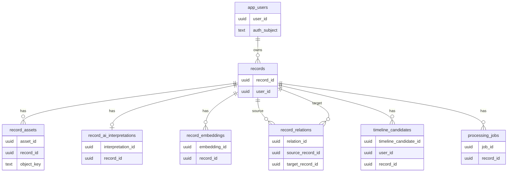

# DB 설계

## 1. 문서 목적

이 문서는 `scene-story-agent` MVP의 PostgreSQL 데이터 구조를 정의한다.

- 포함 범위:
  - 원본 기록
  - 원본 파일 메타데이터
  - AI 해석 정보
  - 임베딩 벡터
  - 연관 기록 후보
  - 타임라인 후보
  - 비동기 작업 상태
  - 삭제 연계 기준
- 제외 범위:
  - 최종 인증 Provider 구현
  - Object Storage 버킷 생성 절차
  - Alembic 마이그레이션 파일
  - 운영 백업 정책 상세
- 전제:
  - DB는 PostgreSQL 18 이상을 사용한다.
  - 벡터 검색은 PostgreSQL의 pgvector를 우선 사용한다.
  - 원본 파일은 DB에 저장하지 않고 Object Storage에 저장한다.
  - DB에는 원본 파일 접근에 필요한 식별자와 메타데이터만 저장한다.
- 참조:
  - 로컬 실행과 Docker Compose 기준은 `.project/core_workflow.md`를 따른다.
  - PostgreSQL 이미지와 초기화 SQL 위치는 `.project/core_project.md`를 따른다.

## 2. 설계 원칙

DB는 원본 기록을 기준으로 연결한다.

- `record_id`를 원본 기록, 파일, AI 해석 정보, 임베딩, 연결 후보, 타임라인 후보의 기준 키로 사용한다.
- 신규 PK는 UUID v7을 우선 사용한다.
- 원본 기록과 AI 해석 정보는 같은 테이블에 섞지 않는다.
- 사용자가 수정 가능한 AI 결과는 수정본과 원본 Provider 응답을 분리한다.
- 원본 파일 URL을 장기 저장하지 않고 `object_key`를 저장한다.
- 임베딩 벡터는 원본 기록과 연결 가능하므로 개인정보에 준해 관리한다.
- 삭제는 원본 기록 기준으로 파생 데이터를 함께 처리한다.

## 3. ERD

초기 MVP의 주요 관계는 다음이다.



## 4. 테이블 설계

MVP 테이블은 기록 생성과 AI 처리 흐름을 우선한다.

### `app_users`

사용자 계정의 최소 식별 정보를 저장한다.

| 컬럼 | 타입 | 필수 | 설명 |
|---|---|---:|---|
| `user_id` | `uuid` | 예 | 내부 사용자 ID |
| `auth_provider` | `text` | 예 | 인증 Provider. 예: `local`, `supabase`, `google` |
| `auth_subject` | `text` | 예 | 외부 인증 주체 ID |
| `email` | `text` | 아니오 | 이메일 |
| `display_name` | `text` | 아니오 | 표시 이름 |
| `created_at` | `timestamptz` | 예 | 생성 시각 |
| `updated_at` | `timestamptz` | 예 | 수정 시각 |
| `deleted_at` | `timestamptz` | 아니오 | 탈퇴 또는 삭제 시각 |

- 제약:
  - `unique(auth_provider, auth_subject)`
  - `deleted_at is null`인 사용자만 기본 조회 대상으로 사용한다.
- Redis 보조:
  - `user:auth:{auth_provider}:{auth_subject}`는 내부 `user_id` 조회 캐시로 사용한다.
  - `user:profile:{user_id}`는 사용자 기본 정보 캐시로 사용한다.
  - Redis cache miss 시 `app_users`를 기준으로 다시 조회한다.
- 확인 필요:
  - 인증 Provider는 구현 전 확정한다.

### `records`

사용자가 남긴 원본 기록의 기준 테이블이다.

| 컬럼 | 타입 | 필수 | 설명 |
|---|---|---:|---|
| `record_id` | `uuid` | 예 | 기록 ID |
| `user_id` | `uuid` | 예 | 소유 사용자 |
| `memo` | `text` | 아니오 | 사용자 메모 |
| `emotion` | `text` | 아니오 | 감정 태그 |
| `satisfaction_score` | `smallint` | 아니오 | 만족도 점수 |
| `happened_at` | `timestamptz` | 아니오 | 사용자가 기록한 발생 시각 |
| `status` | `text` | 예 | 기록 상태 |
| `created_at` | `timestamptz` | 예 | 생성 시각 |
| `updated_at` | `timestamptz` | 예 | 수정 시각 |
| `deleted_at` | `timestamptz` | 아니오 | 삭제 시각 |

- 허용 상태:
  - `draft`
  - `processing`
  - `ready`
  - `failed`
  - `deleted`
- 인덱스:
  - `(user_id, happened_at desc)`
  - `(user_id, created_at desc)`
  - `(user_id, status)`
- 기준:
  - 기록 목록과 상세 조회의 시작점이다.
  - 삭제 시 `deleted_at`과 `status = 'deleted'`를 함께 기록한다.

### `record_assets`

원본 사진과 영상의 저장소 메타데이터를 저장한다.

| 컬럼 | 타입 | 필수 | 설명 |
|---|---|---:|---|
| `asset_id` | `uuid` | 예 | 파일 ID |
| `record_id` | `uuid` | 예 | 소속 기록 |
| `asset_type` | `text` | 예 | `photo`, `video`, `thumbnail` |
| `storage_provider` | `text` | 예 | `local`, `r2`, `s3` |
| `bucket_name` | `text` | 예 | 버킷 이름 |
| `object_key` | `text` | 예 | 저장소 객체 키 |
| `content_type` | `text` | 예 | MIME type |
| `byte_size` | `bigint` | 아니오 | 파일 크기 |
| `width` | `integer` | 아니오 | 이미지 또는 영상 너비 |
| `height` | `integer` | 아니오 | 이미지 또는 영상 높이 |
| `duration_seconds` | `integer` | 아니오 | 영상 길이 |
| `checksum_sha256` | `text` | 아니오 | 중복 확인용 checksum |
| `created_at` | `timestamptz` | 예 | 생성 시각 |
| `deleted_at` | `timestamptz` | 아니오 | 삭제 시각 |

- 제약:
  - `unique(storage_provider, bucket_name, object_key)`
- 기준:
  - 공개 URL이나 서명 URL은 저장하지 않는다.
  - 사용자 조회 시 API 서버가 권한 확인 후 서명 URL을 발급한다.

### `record_ai_interpretations`

AI가 생성한 해석 정보와 사용자 수정 정보를 저장한다.

| 컬럼 | 타입 | 필수 | 설명 |
|---|---|---:|---|
| `interpretation_id` | `uuid` | 예 | AI 해석 ID |
| `record_id` | `uuid` | 예 | 대상 기록 |
| `provider` | `text` | 예 | AI Provider |
| `model` | `text` | 예 | 모델명 |
| `scene_type` | `text` | 아니오 | 장면 유형 |
| `summary` | `text` | 아니오 | 요약 |
| `ocr_candidates` | `jsonb` | 아니오 | OCR 후보 |
| `place_candidates` | `jsonb` | 아니오 | 장소 후보 |
| `visit_time_candidates` | `jsonb` | 아니오 | 방문 시간 후보 |
| `menu_candidates` | `jsonb` | 아니오 | 메뉴 후보 |
| `activity_candidates` | `jsonb` | 아니오 | 활동 후보 |
| `amount_candidates` | `jsonb` | 아니오 | 금액 후보 |
| `similar_record_candidates` | `jsonb` | 아니오 | 유사 기록 후보 |
| `revisit_candidates` | `jsonb` | 아니오 | 재방문 후보 |
| `timeline_candidates` | `jsonb` | 아니오 | 타임라인 후보 |
| `tags` | `jsonb` | 아니오 | 태그 목록 |
| `user_corrections` | `jsonb` | 아니오 | 사용자 수정값 |
| `raw_response_ref` | `jsonb` | 아니오 | 원문 응답 참조 정보 |
| `status` | `text` | 예 | AI 해석 상태 |
| `created_at` | `timestamptz` | 예 | 생성 시각 |
| `updated_at` | `timestamptz` | 예 | 수정 시각 |
| `deleted_at` | `timestamptz` | 아니오 | 삭제 시각 |

- 허용 상태:
  - `pending`
  - `completed`
  - `failed`
  - `user_edited`
- 제약:
  - MVP에서는 `record_id`당 최신 해석 1건을 우선 사용한다.
- 기준:
  - Provider 응답 원문 전체를 그대로 DB에 저장하지 않는다.
  - 장애 재현에 필요한 참조 ID만 `raw_response_ref`에 저장한다.
  - Provider가 토큰 메타를 제공하면 `raw_response_ref.token_usage`에 사용 토큰, 입력 토큰, 출력 토큰, 남은 토큰을 저장한다.
  - 남은 토큰을 Provider가 제공하지 않으면 `null`로 저장한다.

### `record_embeddings`

검색용 임베딩 벡터를 저장한다.

| 컬럼 | 타입 | 필수 | 설명 |
|---|---|---:|---|
| `embedding_id` | `uuid` | 예 | 임베딩 ID |
| `record_id` | `uuid` | 예 | 대상 기록 |
| `provider` | `text` | 예 | 임베딩 Provider |
| `model` | `text` | 예 | 임베딩 모델 |
| `dimension` | `integer` | 예 | 벡터 차원 |
| `embedding` | `vector` | 예 | pgvector 벡터 |
| `input_snapshot` | `jsonb` | 예 | 임베딩 입력 요약 |
| `created_at` | `timestamptz` | 예 | 생성 시각 |
| `deleted_at` | `timestamptz` | 아니오 | 삭제 시각 |

- 인덱스:
  - `ivfflat` 또는 `hnsw` 벡터 인덱스는 데이터량과 pgvector 버전 확인 후 선택한다.
  - `(record_id, created_at desc)`
- 기준:
  - 벡터 테이블에는 직접 사용자 식별자를 두지 않는다.
  - 사용자 범위 필터는 `records` 조인으로 처리한다.
  - 임베딩 차원은 모델 선택 후 확정한다.
  - 임베딩 모델 확정 전에는 설계상 `vector`로 표현하고, 마이그레이션 시 `vector(n)`으로 차원을 고정한다.

### `record_relations`

유사 기록, 같은 장소 후보, 재방문 후보를 저장한다.

| 컬럼 | 타입 | 필수 | 설명 |
|---|---|---:|---|
| `relation_id` | `uuid` | 예 | 관계 ID |
| `source_record_id` | `uuid` | 예 | 현재 기록 |
| `target_record_id` | `uuid` | 예 | 후보 기록 |
| `relation_type` | `text` | 예 | 관계 유형 |
| `similarity_score` | `numeric(6,5)` | 아니오 | 벡터 유사도 |
| `decision_status` | `text` | 예 | 사용자 또는 AI 판단 상태 |
| `reasons` | `jsonb` | 아니오 | 연결 근거 |
| `created_at` | `timestamptz` | 예 | 생성 시각 |
| `updated_at` | `timestamptz` | 예 | 수정 시각 |

- 허용 관계 유형:
  - `similar_scene`
  - `same_place_candidate`
  - `similar_topic`
  - `revisit_candidate`
  - `timeline_candidate`
- 허용 판단 상태:
  - `suggested`
  - `accepted`
  - `rejected`
  - `hidden`
- 제약:
  - `source_record_id <> target_record_id`
  - `unique(source_record_id, target_record_id, relation_type)`

### `timeline_candidates`

타임라인으로 묶을 수 있는 기록 후보를 저장한다.

| 컬럼 | 타입 | 필수 | 설명 |
|---|---|---:|---|
| `timeline_candidate_id` | `uuid` | 예 | 타임라인 후보 ID |
| `user_id` | `uuid` | 예 | 사용자 ID |
| `record_id` | `uuid` | 예 | 대상 기록 |
| `timeline_type` | `text` | 예 | 타임라인 유형 |
| `grouping_key` | `text` | 예 | 묶음 기준 키 |
| `confidence_score` | `numeric(6,5)` | 아니오 | 후보 신뢰도 |
| `reasons` | `jsonb` | 아니오 | 후보 근거 |
| `created_at` | `timestamptz` | 예 | 생성 시각 |

- 허용 타임라인 유형:
  - `time`
  - `place`
  - `scene_type`
  - `emotion`
  - `topic`
- 기준:
  - MVP에서는 확정 타임라인 테이블을 두지 않고 후보를 조회해 화면에서 구성한다.
  - 사용자가 저장한 큐레이션 기능이 생기면 별도 `timelines`, `timeline_records` 테이블을 추가한다.

### `processing_jobs`

AI 분석과 임베딩 생성 작업 상태를 저장한다.

| 컬럼 | 타입 | 필수 | 설명 |
|---|---|---:|---|
| `job_id` | `uuid` | 예 | 작업 ID |
| `record_id` | `uuid` | 예 | 대상 기록 |
| `job_type` | `text` | 예 | 작업 유형 |
| `status` | `text` | 예 | 작업 상태 |
| `attempt_count` | `integer` | 예 | 시도 횟수 |
| `last_error_code` | `text` | 아니오 | 마지막 오류 코드 |
| `last_error_message` | `text` | 아니오 | 사용자 비노출 오류 요약 |
| `available_at` | `timestamptz` | 예 | 실행 가능 시각 |
| `started_at` | `timestamptz` | 아니오 | 시작 시각 |
| `finished_at` | `timestamptz` | 아니오 | 종료 시각 |
| `created_at` | `timestamptz` | 예 | 생성 시각 |
| `updated_at` | `timestamptz` | 예 | 수정 시각 |

- 허용 작업 유형:
  - `extract_ai_interpretation`
  - `create_embedding`
  - `find_related_records`
  - `generate_timeline_candidates`
  - `delete_record_artifacts`
- 허용 상태:
  - `queued`
  - `running`
  - `succeeded`
  - `failed`
  - `retrying`
  - `canceled`
- 기준:
  - PostgreSQL은 최종 추적 가능한 작업 상태를 저장한다.
  - Redis는 작업 실행 lock, 작업 상태 캐시, 중복 등록 완화에만 사용한다.
  - 작업 재시도와 실패 원인은 `processing_jobs`를 기준으로 판단한다.

### Redis 보조 key

Redis key는 정본 데이터가 아니라 보조 최적화 값이다.

- 작업 처리:
  - `job:lock:{job_id}`:
    - 같은 작업의 동시 실행을 완화한다.
    - TTL은 5분으로 둔다.
    - 값은 실행 token으로 둔다.
  - `job:state:{job_id}`:
    - 작업 상태 조회를 캐시한다.
    - TTL은 30~60초로 둔다.
    - cache miss 시 `processing_jobs`에서 조회한다.
  - `record:job:dedupe:{record_id}:{job_type}`:
    - 같은 기록의 같은 작업 중복 등록을 완화한다.
    - TTL은 5분으로 둔다.
    - hit 시 기존 `job_id`를 반환한다.
- 로그인 보조:
  - `session:{session_id}`:
    - 로그인 세션 캐시로 사용한다.
    - MVP TTL은 7일로 둔다.
    - Redis 값이 없으면 재로그인 또는 서버 세션 재검증으로 복구한다.
    - 강제 로그아웃이나 기기별 세션 관리가 필요하면 PostgreSQL `user_sessions`를 정본으로 추가한다.
  - `user:auth:{auth_provider}:{auth_subject}`:
    - 인증 주체에서 내부 `user_id`를 찾는 캐시로 사용한다.
    - TTL은 10분~1시간으로 둔다.
  - `user:profile:{user_id}`:
    - 사용자 기본 정보 캐시로 사용한다.
    - TTL은 10분으로 둔다.
  - `auth:rate:{key}`:
    - 로그인과 인증 요청 제한에 사용한다.
    - TTL은 1분으로 둔다.

- 저장 제외:
  - API key
  - 원본 파일 URL
  - OCR 원문
  - AI Provider 응답 원문
  - 장기 보관이 필요한 작업 상태

## 5. 삭제 연계

삭제는 원본 기록을 기준으로 처리한다.

### 기록 삭제 절차

1. `records.status`를 `deleted`로 바꾸고 `deleted_at`을 기록한다.
2. `record_assets.deleted_at`을 기록한다.
3. Object Storage의 원본 파일 삭제 작업을 등록한다.
4. `record_embeddings.deleted_at`을 기록한다.
5. `record_relations`에서 관련 후보를 숨기거나 삭제한다.
6. `timeline_candidates`에서 관련 후보를 삭제한다.
7. 삭제 작업 결과를 `processing_jobs`에 남긴다.

### 삭제 기준

- 사용자 조회에서는 `deleted_at is null`만 반환한다.
- Object Storage 삭제가 실패하면 `delete_record_artifacts` 작업으로 재시도한다.
- AI Provider 전송 원문은 서비스 DB에 장기 저장하지 않는다.
- 백업 데이터 보관 기간은 운영 정책에서 별도로 확정한다.

## 6. 조회 패턴

초기 API는 아래 조회 패턴을 우선 지원한다.

### 기록 목록

- 조건:
  - `records.user_id`
  - `records.deleted_at is null`
- 정렬:
  - `happened_at desc nulls last`
  - `created_at desc`
- 함께 조회:
  - 대표 `record_assets`
  - 최신 `record_ai_interpretations`

### 기록 상세

- 기준:
  - `record_id`
  - `user_id`
- 함께 조회:
  - 전체 `record_assets`
  - 최신 `record_ai_interpretations`
  - `record_relations`
  - `timeline_candidates`

### 유사 기록 검색

- 기준:
  - 현재 `record_embeddings.embedding`
  - 같은 사용자 기록만 조회
  - 삭제된 기록 제외
- 구현 기준:
  - pgvector 연산은 Postgres 함수로 감싸거나 서버 SQL query 경계에서 호출한다.
  - API 서버는 Postgres 함수 또는 SQLAlchemy text query로 호출한다.

## 7. 초기 SQL 초안

이 SQL은 PostgreSQL 18 이상 기준 설계 확인용 초안이다.

### 권한 기준

운영 환경은 DB owner 계정과 API 서버 앱 계정을 분리한다.

- 관리자 계정:
  - DB와 role을 생성한다.
  - extension을 생성한다.
  - migration 권한을 관리한다.
- 앱 계정:
  - API 서버가 접속한다.
  - 필요한 schema, table, sequence 권한만 가진다.
- 로컬 실행:
  - `.project/core_workflow.md`의 환경 변수와 Docker Compose 기준을 따른다.
  - 로컬에서는 별도 앱 계정 분리를 필수로 두지 않는다.
- dev/prd 실행:
  - 자체 운영 PostgreSQL의 관리자 계정을 사용한다.
  - 실제 비밀번호는 서버 환경 변수 또는 secret 파일로 주입한다.

관리자 DB에서 실행한다.

```sql
drop database if exists scene_story_agent with (force);
drop role if exists scene_story_agent_app;

create role scene_story_agent_app
with login
password 'scene_story_agent';

create database scene_story_agent
with owner scene_story_agent_app
encoding 'UTF8'
template template0;
```

애플리케이션 DB에서 실행한다.

```sql
create extension if not exists vector;

grant connect on database scene_story_agent
to scene_story_agent_app;

grant usage, create on schema public
to scene_story_agent_app;

grant select, insert, update, delete
on all tables in schema public
to scene_story_agent_app;

grant usage, select, update
on all sequences in schema public
to scene_story_agent_app;

alter default privileges in schema public
grant select, insert, update, delete
on tables
to scene_story_agent_app;

alter default privileges in schema public
grant usage, select, update
on sequences
to scene_story_agent_app;
```

### 테이블 생성

```sql
create extension if not exists vector;

create table app_users (
    user_id uuid primary key default uuidv7(),
    auth_provider text not null,
    auth_subject text not null,
    email text,
    display_name text,
    created_at timestamptz not null default now(),
    updated_at timestamptz not null default now(),
    deleted_at timestamptz,
    unique (auth_provider, auth_subject)
);

create table records (
    record_id uuid primary key default uuidv7(),
    user_id uuid not null references app_users(user_id),
    memo text,
    emotion text,
    satisfaction_score smallint,
    happened_at timestamptz,
    status text not null default 'draft',
    created_at timestamptz not null default now(),
    updated_at timestamptz not null default now(),
    deleted_at timestamptz,
    check (satisfaction_score is null or satisfaction_score between 1 and 5),
    check (status in ('draft', 'processing', 'ready', 'failed', 'deleted'))
);

create index idx_records_user_happened_at
    on records (user_id, happened_at desc);

create index idx_records_user_created_at
    on records (user_id, created_at desc);

create table record_assets (
    asset_id uuid primary key default uuidv7(),
    record_id uuid not null references records(record_id),
    asset_type text not null,
    storage_provider text not null,
    bucket_name text not null,
    object_key text not null,
    content_type text not null,
    byte_size bigint,
    width integer,
    height integer,
    duration_seconds integer,
    checksum_sha256 text,
    created_at timestamptz not null default now(),
    deleted_at timestamptz,
    unique (storage_provider, bucket_name, object_key),
    check (asset_type in ('photo', 'video', 'thumbnail'))
);

create table record_ai_interpretations (
    interpretation_id uuid primary key default uuidv7(),
    record_id uuid not null references records(record_id),
    provider text not null,
    model text not null,
    scene_type text,
    summary text,
    ocr_candidates jsonb,
    place_candidates jsonb,
    visit_time_candidates jsonb,
    menu_candidates jsonb,
    activity_candidates jsonb,
    amount_candidates jsonb,
    similar_record_candidates jsonb,
    revisit_candidates jsonb,
    timeline_candidates jsonb,
    tags jsonb,
    user_corrections jsonb,
    raw_response_ref jsonb,
    status text not null default 'pending',
    created_at timestamptz not null default now(),
    updated_at timestamptz not null default now(),
    deleted_at timestamptz,
    check (status in ('pending', 'completed', 'failed', 'user_edited'))
);

create table record_embeddings (
    embedding_id uuid primary key default uuidv7(),
    record_id uuid not null references records(record_id),
    provider text not null,
    model text not null,
    dimension integer not null,
    embedding vector,
    input_snapshot jsonb not null,
    created_at timestamptz not null default now(),
    deleted_at timestamptz
);

create table record_relations (
    relation_id uuid primary key default uuidv7(),
    source_record_id uuid not null references records(record_id),
    target_record_id uuid not null references records(record_id),
    relation_type text not null,
    similarity_score numeric(6,5),
    decision_status text not null default 'suggested',
    reasons jsonb,
    created_at timestamptz not null default now(),
    updated_at timestamptz not null default now(),
    check (source_record_id <> target_record_id),
    check (relation_type in (
        'similar_scene',
        'same_place_candidate',
        'similar_topic',
        'revisit_candidate',
        'timeline_candidate'
    )),
    check (decision_status in ('suggested', 'accepted', 'rejected', 'hidden')),
    unique (source_record_id, target_record_id, relation_type)
);

create table timeline_candidates (
    timeline_candidate_id uuid primary key default uuidv7(),
    user_id uuid not null references app_users(user_id),
    record_id uuid not null references records(record_id),
    timeline_type text not null,
    grouping_key text not null,
    confidence_score numeric(6,5),
    reasons jsonb,
    created_at timestamptz not null default now(),
    check (timeline_type in ('time', 'place', 'scene_type', 'emotion', 'topic'))
);

create table processing_jobs (
    job_id uuid primary key default uuidv7(),
    record_id uuid not null references records(record_id),
    job_type text not null,
    status text not null default 'queued',
    attempt_count integer not null default 0,
    last_error_code text,
    last_error_message text,
    available_at timestamptz not null default now(),
    started_at timestamptz,
    finished_at timestamptz,
    created_at timestamptz not null default now(),
    updated_at timestamptz not null default now(),
    check (job_type in (
        'extract_ai_interpretation',
        'create_embedding',
        'find_related_records',
        'generate_timeline_candidates',
        'delete_record_artifacts'
    )),
    check (status in ('queued', 'running', 'succeeded', 'failed', 'retrying', 'canceled'))
);
```

## 8. 확인 필요

아래 항목은 구현 전 확정한다.

- 인증 Provider와 `app_users` 범위
- 만족도 입력 방식:
  - 1~5 점수
  - 감정 태그
  - 자유 메모 조합
- 임베딩 모델과 벡터 차원
- pgvector 인덱스 방식:
  - `hnsw`
  - `ivfflat`
- AI Provider 응답 원문 보관 여부와 보관 위치
- Object Storage Provider별 `bucket_name`, `object_key` 네이밍 규칙
- 물리 삭제와 soft delete의 운영 기준
- 자체 운영 PostgreSQL의 백업, 복구, 권한 분리 기준
- 운영 DB가 PostgreSQL 18과 `uuidv7()`를 지원하는지 확인
- 운영 단계에서 PostgreSQL `user_sessions` 테이블이 필요한지 확인

## 9. 출처

- `docs/product-spec.md`
- `docs/development-infra.md`
- `docs/privacy-compliance.md`
- `.wiki/index.md`
- `docker-compose.yml`
- `.project/core_workflow.md`
- `.project/core_project.md`

## 이력관리

- 2026-05-30: AI 해석 토큰 사용량을 `raw_response_ref.token_usage`에 저장하는 기준 추가
- 2026-05-27: AI 해석 후보에 방문 시간, 활동, 유사 기록, 재방문, 타임라인 후보 컬럼 추가
- 2026-05-24: 인프라 실행 절차를 정본 문서 참조로 대체하고 출처 정리
- 2026-05-23: PostgreSQL 18, pgvector, UUID v7, 관리자·앱 계정 기준 반영
- 2026-05-22: MVP DB 설계 초안 작성
